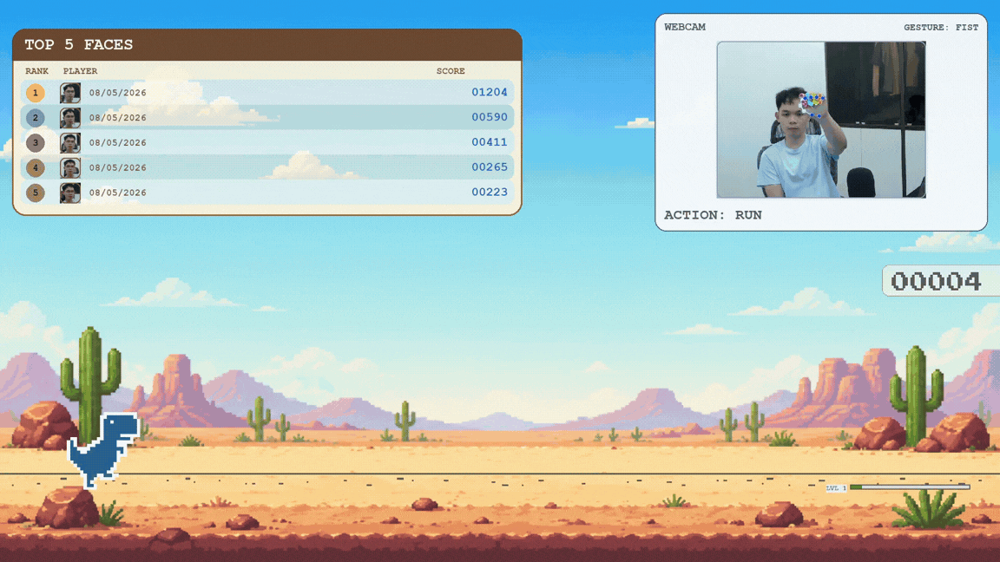

# T-Rex Rush - Gesture Control Edition
**NEU Faculty of Information Technology (FIT)**


<p align="center">
  <br/>
  <i>Demo</i>
</p>

## Cài đặt
Tạo môi trường mới:
```bash
python -m venv trex
```
Kích hoạt môi trường:
```bash
trex\Scripts\activate
```
Cài đặt thư viện:
```bash
pip install -r requirements.txt
```

## Chạy game

```bash
python main.py
```

> Cần có webcam. Khi khởi động, camera sẽ được bật tự động.


## Điều khiển bằng cử chỉ tay

| Cử chỉ | Hành động |
|--------|-----------|
| 🤟 **I Love You** | Bắt đầu chơi (Start Game) |
| 🖐️ **Open Palm** (mở bàn tay) | Nhảy (Jump) |
| ✌️ **Victory** | Cúi (Duck) |
| ✊ **Closed Fist** (nắm tay) | Không làm gì (Idle) |

**Lưu ý:** Giữ tay cách camera khoảng 30–50 cm để nhận diện tốt nhất.


